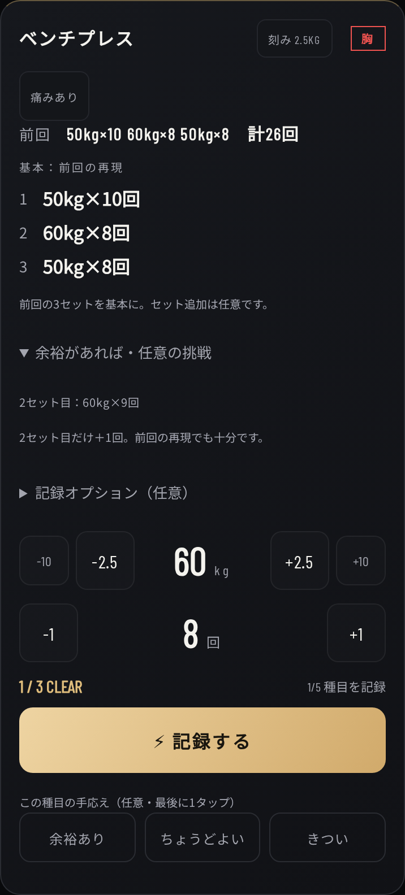

# 前回の再現と任意の挑戦

## 使い方

種目を選ぶと、前回の各セットの重量・回数を同じ順番で表示し、次に記録するセットの入力欄へ入れる。50kg×10、60kg×8、50kg×8なら基本はその3セット。旧テンプレートが4セットでも、埋め合わせは要求しない。増量候補を入力欄へ自動適用しない。

最後のセットを記録したら「余裕あり / ちょうどよい / きつい」を任意で1タップ。押さなくても使える。同じ選択をもう一度押せば解除。セットを追加した場合は手応えを未選択に戻す（別のセット構成に以前の評価を流用しない）。

「記録オプション」では当該セットをウォームアップと指定できる。履歴には残し、次回の基本目標から除外する。重量だけから準備セットを推測しない。懸垂には自重・加重・アシストの方式選択を用意。旧ログの正のkgは加重か補助か推測せず、元の数値を残す。

## 優先順位

1. 今日または直近の種目に痛み：数値目標・任意の挑戦を休止。履歴と手動記録は利用可能。
2. 記録なし：回数レンジを参考として案内。セット数の義務を作らない。
3. 14日以上の間隔：前回は参考値として表示し、挑戦を休止。
4. 中断・未終了セッション：記録は次回の参考に使うが、進行の根拠にはしない。
5. 直近3回が同じ重量・方式・セット数で2回続けてrep低下：上積みを提案しない。
6. 「きつい」：上積みなし。「ちょうどよい」または未入力：前回を再現。
7. 「余裕あり」：以下の任意の候補を別表示。

- 同じ構成で別日に2回rep上限に到達した重量グループは、機器の刻みで増量する候補。そのグループだけrep下限から再構築する。最初のセット重量だけに限定しない。
- 刻みが当該重量の10%を超える場合は増量候補を出さない。
- それ以外はrep上限未満の1セットだけ＋1回。外部重量なら重いセットを優先。
- 自重懸垂を自動的に加重へ変更しない。明示的なアシスト記録では、補助kgを減らす方向が挑戦になる。
- 14日、2回、10%は保守的なアプリの設計値であり、生理学的な絶対基準ではない。

## データ・互換性

- エンジンは `js/training-targets.mjs` の純関数。`training-core.mjs` から再exportする。
- 基本を `suggestedSets: [{kg,reps,loadMode}]`、任意候補を `challenge` として区別。
- 混合重量は互換フィールド `weight` をnullとし、ひとつの重量へ丸めない。pain時は `suggestedSets=[]` とし、数値の計算を止める。
- `gym_logs` の既存行は変更しない。新規行に任意の `kind` と `loadMode` を追加するだけ。
- 手応えは既存 `gym_daily_v2[day].exerciseFeedback[exercise]` の `{lastSetAt,effort}` に保存。最後のログの時刻が一致する場合だけ利用する。別セッションや追加セットへの誤流用を防ぐ。
- 懸垂の選択方式は `gym_profile_v2.exerciseLoadModes` に追加保存。各ログにも方式を残すため、設定変更で過去の意味を変更しない。
- Quest / XP / モンク育成 / プラン生成は従来の記録ベースで判定する。筋力目標や任意の挑戦を達成する必要はない。
- AI Coachにもセット別基本目標と任意候補を別々に渡し、必達扱いしないよう指示する。
- Service Workerはv49。新モジュールも事前キャッシュする。

## 検証

- `TZ=Asia/Tokyo node --test tests/*.test.mjs`
- `NODE_PATH=<playwrightの親ディレクトリ> BROWSER_PATH=<Chromium> node tests/training-targets-ui.cjs`
- 同じ環境で `node tests/gym-ui.cjs`
- 新規の目標UI：320 / 375 / 390 / 430px。既存Gym回帰：320 / 375 / 390 / 430 / 1024px。
- 混合重量の順次プリフィル、手応えの保存/解除/再読込、pain優先、準備セット、補助重量、Quest進行、既存ログ/XP保持、オフラインと旧キャッシュ削除を確認。
- iPhone実機/Safariでは未確認。agent-browser CLIはdaemon起動に失敗したため、ブラウザー検証はPlaywright + Chromiumで実行した。

