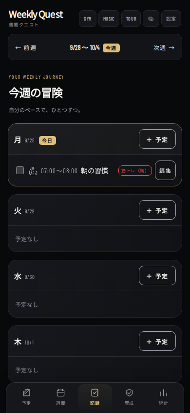
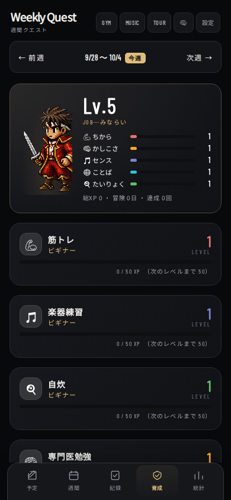
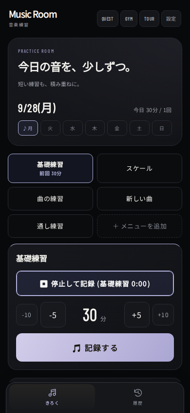
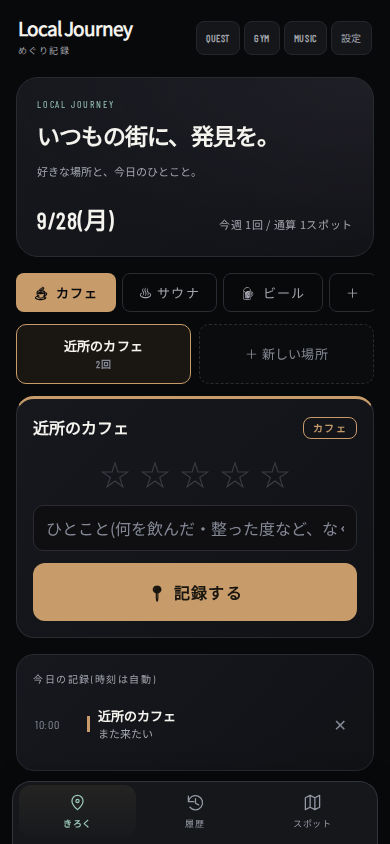

# App-wide visual refresh

Gym Quest (PR #18) の黒〜チャコール・柔らかなカード・控えめなゴールドを4画面で共有する。

- `css/weekly-theme.css`: 共通トークン、ヘッダー、カード、入力、モーダル、下部ナビ、レスポンシブと reduced motion。
- 既存インラインCSSの後に読み込み、Gym固有CSSはさらに後に読み込む。`body[data-app]` で音楽のラベンダー、めぐりのセージを限定。予定カテゴリ色は従来通り。
- Weekly: 予定／記録のイントロ、週間カレンダー、育成・XP、統計まで統一。既存キャラクター表示・idle・拡大を維持。
- Music Room / Local Journey: 今日の見出し、曜日チップ、入力、履歴・スポットを統一。全画面フラッシュは抑制し、既存の保存トーストを表示。
- データ保存・XP・Google Calendar・タイマーの計算は変更しない。保存キー／スキーマの変更・移行なし。
- SW v46で共有CSSをプリキャッシュ。4つのmanifestとtheme-colorを背景に合わせる。

## Validation

```sh
node --test tests/*.test.mjs
BROWSER_PATH=<chromium> node tests/gym-ui.cjs
BROWSER_PATH=<chromium> node tests/app-ui.cjs
```

Playwrightが必要（開発確認用、アプリの依存ではない）。`QA_FONTS` に @fontsource（noto-sans-jp / barlow-condensed / noto-emoji）の親ディレクトリを指定するとローカルフォントでスクリーンショット確認可。`QA_SCREENSHOTS` に出力先を指定。

Chromium: 320/375/390/430/1024pxで4画面の全タブを確認。予定追加と記録保存、音楽→Weekly連携、タイマー再開、既存訪問履歴を保持した追加、設定開閉、各画面のオフライン再読込を確認。Gymの既存回帰と125件のロジックテストも実施。
実機iPhone / Safari、実アカウントGoogle OAuthは未確認。

スクリーンショットはテスト用データであり、実際のユーザーログではない。

| Weekly | 育成 | 音楽 | めぐり |
| --- | --- | --- | --- |
|  |  |  |  |
