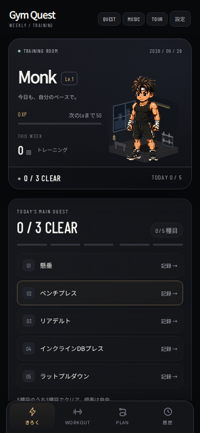
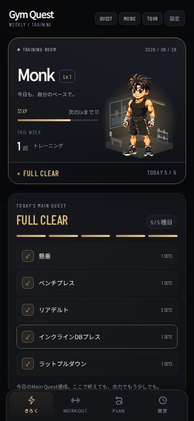

# Gym Quest UI

## Reused structure

- `gym.html` owns both quick logging and Workout DOM. Both still write sets through `saveSet()` to `gym_logs` and synchronize `wt_records` through `syncQuest()`.
- `js/training-core.mjs` remains responsible for double progression, session history, pain constraints, 3-of-5 completion and Weekly's XP/level calculation. Exercise definitions now also expose their existing slot so quick logging can read Workout pain flags correctly.
- `js/training-data.mjs` retains existing program migration, sessions, backup and localStorage keys. No program migration or reset is added by this UI change.
- `js/training-plan.mjs` and Google Calendar event classification/fetch logic remain unchanged. The route renders the existing planner output.
- The existing Monk Lv1/10/20/30/40 PNGs are reused with two-frame idle clipping, matching Weekly's approach. No sprite is regenerated.

## Layout and behavior

The opening screen contains a Monk dossier and a five-exercise checklist. Each row selects the exercise and scrolls directly to the existing weight/rep controls. Other exercises remain available in a collapsible picker. The input card repeats the live quest status, so recording does not require scrolling back to the hero.

The hero has an original SVG training corner with a window, mat and dumbbell rack. This follows the shared-space/companion idea in the user-provided Lofi Desk reference, with a refined black/charcoal theme, rounded layered cards, clearer type hierarchy, line icons and restrained gold accents. The user's later ToDopa reference informed the sense of feedback; celebration remains brief and local to the character. The reference's artwork, audio and characters are not copied.

Today’s distinct logged exercise names determine the state, regardless of order or whether the user uses quick logging or Workout mode:

| Recorded | State |
| --- | --- |
| 0–2 of 5 | Neutral progress; records remain saved |
| 3 of 5 | MAIN QUEST CLEAR |
| 4 of 5 | BONUS CLEAR |
| 5 of 5 | FULL CLEAR |

A repeated set does not count as another exercise. The room's light strengthens with progress; a short pulse plays on an increase. Reduced-motion preferences disable sprite animation and pulses. No fullscreen flashes, sound, extra claims or reward confirmations are required.

Ending a Workout requires one save tap; difficulty remains optional. A partial Workout retains its existing `aborted` status and all sets. XP continues to come from Weekly's existing per-body-part records even for partial training. There is no separate XP balance or bonus XP award.

The weekly training count is the number of local calendar days with logs, including partial days, deduplicating repeated sessions. The route distinguishes CLEAR, LOGGED, QUEST, BLOCKED and REST. Rest is labeled RECOVERY DAY. The planner's existing calendar constraints and editable overrides remain available on PLAN.

## Compatibility and consistency

- No logs, manually finished sessions or user-edited programs are removed or reset on launch.
- The dashboard derives progress from logs; deleting a set updates it immediately.
- Today's plan credit is rechecked against logs after deletion. Older completed sessions remain historical facts and are not reinterpreted against new templates.
- Auto-created free sessions can be marked `aborted` with an additive `questAutoUndone` flag when the qualifying set is deleted, and restored on re-entry without creating a duplicate. This only affects `source: free` sessions.
- Quick-log pain uses an optional per-exercise `pain` object inside the existing daily entry. Workout's slot-based pain and Weekly notes/ratings remain intact.
- External storage updates refresh hero/route panels without replacing an in-progress input.
- PWA manifests, home screen metadata, safe-area padding and app links remain intact. Service Worker cache is `weekly-quest-v45`; the new CSS, view module and room SVG are precached along with all Monk tiers.

## Mobile preview

Synthetic QA data, 390px wide.

| Opening screen | Full clear |
| --- | --- |
|  |  |

## Validation

Pure logic and data tests:

```sh
node --test tests/*.test.mjs
```

Browser regression checks (optional development dependencies; no runtime framework/package dependency):

```sh
NODE_PATH=/path/to/node_modules BROWSER_PATH=/path/to/chromium node tests/gym-ui.cjs
```

The browser suite covers arbitrary exercise order, repeated sets, all clear thresholds, undo/re-entry, reload persistence, 320/375/390/430/1024px widths, partial Workout finish, mixed recording modes, pain constraints, legacy logs/notes, reduced motion, cache replacement and offline reload. Locally installed `@fontsource/noto-sans-jp` and `@fontsource/barlow-condensed` can be supplied with `QA_FONTS=/path/to/node_modules/@fontsource` for screenshots without font network requests. `QA_SCREENSHOTS=/output/directory` saves the opening and full-clear views.

Checked in Chromium with mobile viewport/touch emulation. Physical iPhone Safari and actual home-screen installation still need a device check; the browser suite does not claim WebKit coverage. Google Calendar's live OAuth is not exercised with a real account; its existing deterministic planner/mapping tests pass.
