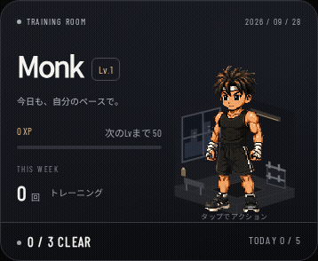

# Monk companion actions

Gym Questの主人公に「構え→正拳突き→構え」と「構え→力こぶポーズ→構え」を追加。待機時もアクション画像の先頭にある「構え」を使い、通常表示とアクションで顔・衣装・絵柄が切り替わらないようにする。

- Lv1/10/20/30/40の全段階で、同じ画像の同じ320×384セルを待機・アクションに利用。Gymでは160×192pxで表示し、足元と位置も一致させる。
- 待機は3.6秒周期のごく小さな呼吸（縦方向0.8%）のみ。Weeklyのステータス／拡大表示、Workout完了カードも同じ構えに統一。
- 既存画像は変更・削除せず、アクション画像が読めない場合の予備として残す。

- 通常は18〜32秒ごとに、正拳突き（0.8秒）と力こぶ（1.76秒）を交互に再生。
- モンクをタップ／キーボード操作でも再生。動作中の連打や短時間の連続再生は抑制。
- 新たに3/4/5種目を達成すると力こぶで反応。画面外で達成した場合は5秒以内に戻ったときのみ再生し、後から古い演出を積み上げない。
- 画面外、別タブ、PWAのバックグラウンドではタイマーとidleを停止。復帰時は待機から再開。
- 入力欄／モーダル操作中は新しいアクションを抑制。
- `prefers-reduced-motion` では同じ構えで静止表示。アクション素材が読めない場合は既存idleへフォールバック。
- Lv1/10/20/30/40に対応。idleが下位レベルへフォールバックした場合はアクションもその衣装に合わせる。
- 記録・XP・localStorage・プラン生成の計算は変更なし。アクションは保存データを書き換えない。
- SW v50で表示コードのキャッシュを更新。5つのWebPは引き続き事前キャッシュされ、オフラインでも利用可能。

## Files

`js/monk-companion.mjs` は表示とライフサイクルのみを担当。Gymの再描画時にはdetachして古いタイマーとIntersectionObserverを破棄する。

[素材と生成プロンプト](monk-action-prompts.md)。画像生成ツールで作成したポーズを再利用。待機用の画像は新規生成せず、同じアトラスの先頭セルをCSSで表示する。元のidle PNGは変更していない。

## Validation

```sh
node --test tests/*.test.mjs
BROWSER_PATH=<chromium> node tests/gym-ui.cjs
BROWSER_PATH=<chromium> node tests/monk-actions-ui.cjs
```

PlaywrightとChromiumは確認環境のみ。139件のロジックテストと既存Gym回帰、アクション遷移／連打／省アニメーション／背景復帰／画面外／タブ切替／達成時／全レベル／ストレージ不変／素材取得失敗／オフラインを確認。320/375/390/430/1024pxで表示確認。待機と構えの画像・セル寸法・足元の一致、Workout完了カードとWeeklyの通常／拡大表示でも同じ画像の1コマだけが見えることを確認。
実機iPhone・Safariは未確認。

以下はアクション初期実装時（v47）のキャプチャ。v50では、このGIFの通常立ち姿がアクション版の構えに置き換わる。見比べるため通常の待機時間を短縮している（テスト用データ）。


